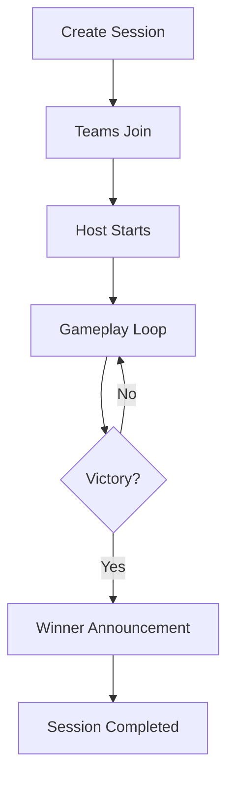

# HivePlay — GAME_FLOW

**Document:** GAME_FLOW.md  
**Project:** HivePlay  
**Status:** Living Document  
**Version:** 1.0  
**Owner:** Product Team

---

# Purpose

This document describes the complete runtime flow of a HivePlay session from creation to completion.

---

# High-Level Flow

---

# Session Creation

Host creates a new session from a published game template.

The system:

- Generates a unique session
- Creates runtime state
- Opens connection endpoints
- Waits for teams

---

# Team Join

Each team joins using a unique session code or QR code.

Validation:

- Session exists
- Session accepting connections
- Team slot available

On success:

- Team marked connected
- Host receives confirmation

---

# Game Start

Host presses **Start Game**.

System:

- Locks session configuration
- Starts session timer
- Enables tile selection

---

# Main Gameplay Loop

## Step 1 — Select Tile

Active team selects an available tile.

Validation:

- Tile exists
- Tile available
- Correct team's turn

---

## Step 2 — Confirm Selection

Host confirms.

Tile state changes:

Available → Selected

---

## Step 3 — Present Media

If media exists:

- Display to audience
- Wait until finished or skipped

---

## Step 4 — Present Question

Question appears on:

- Audience display
- Team devices

Server starts countdown.

---

## Step 5 — Collect Answers

Both teams may answer simultaneously.

Each answer contains:

- Selected option
- Timestamp

---

## Step 6 — Validate

Server evaluates:

- Correctness
- Response time

Winner determined according to GAME_RULES.md.

---

## Step 7 — Resolve Tile

Possible outcomes:

- Claimed by Team A
- Claimed by Team B
- Burned

---

## Step 8 — Check Victory

Immediately after every successful claim:

- Build connectivity graph
- Search for winning path

If found:

Session ends.

Otherwise:

Continue.

---

## Step 9 — Next Turn

Winning team becomes active team.

Return to tile selection.

---

# Pause Flow

Host may pause gameplay.

Effects:

- Freeze timers
- Disable answers
- Maintain state

Resume restores previous state.

---

# Disconnect Flow

If a team disconnects:

- Gameplay may continue or pause (host decision)
- Reconnecting device receives latest session snapshot

---

# Session Completion

Actions:

- Lock session
- Persist events
- Persist statistics
- Display winner
- Disable further input

---

# Error Handling

Invalid tile:
Ignored.

Late answer:
Marked incorrect.

Duplicate answer:
First valid answer retained.

Lost connection:
Reconnect supported.

---

# Related Documents

- GAME_RULES.md
- DOMAIN_MODEL.md
- DATABASE.md
- API.md
- UX.md

---

# Change Policy

Any gameplay flow modification must update this document before implementation.
