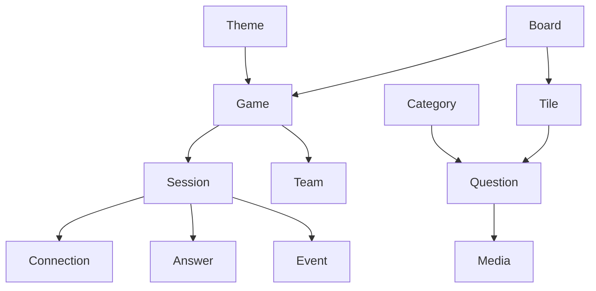

# HivePlay — Domain Model

**Document:** DOMAIN_MODEL.md  
**Project:** HivePlay  
**Status:** Living Document  
**Version:** 1.0  
**Owner:** Product Team

---

# Purpose

This document defines the business domain of HivePlay independently from implementation details such as the database schema, APIs, or UI.

It establishes the core business entities, their responsibilities, relationships, and lifecycle.

---

# Domain Overview

HivePlay is built around three primary layers:

1. Content
2. Game Templates
3. Live Sessions

Each layer has a single responsibility and depends only on the layer above it.

```text
Content
    ↓
Game Templates
    ↓
Live Sessions
```

---

# Core Domain Entities

## Question

A reusable trivia item containing one or more answers and optional media.

Responsibilities:
- Belongs to a category
- Can be reused across games
- Never stores runtime information

Lifecycle:
Draft → Published → Archived

---

## Category

Logical grouping of questions.

Responsibilities:
- Organize questions
- Enable filtering
- Support reporting

---

## Media

Reusable assets attached to questions.

Supported types:
- Image
- Video
- Audio

---

## Theme

Defines the visual identity of a game.

Responsibilities:
- Colors
- Typography
- Branding
- Visual assets

---

## Board

A reusable collection of connected hexagonal tiles.

Responsibilities:
- Define topology
- Define winning axes
- Contain tiles

---

## Tile

A single playable location on a board.

States:
- Available
- Selected
- Claimed
- Burned

Each tile references one or more questions through the game configuration.

---

## Game

A reusable template describing how gameplay works.

Contains:
- Board
- Teams
- Rules
- Theme
- Question pools

Games never store runtime state.

---

## Team

Represents one competing side.

Contains:
- Name
- Color
- Winning axis

---

## Session

A live execution of a game template.

Contains:
- Connected devices
- Runtime state
- Tile ownership
- Current question
- Answers
- Events

Destroying a session never affects the source game.

---

## Connection

Represents a connected client.

Types:
- Host
- Team
- Audience

---

## Answer

A runtime response submitted during a session.

Contains:
- Selected option
- Timestamp
- Validation result

---

## Event

Immutable record describing something that happened during gameplay.

Examples:
- Session started
- Tile selected
- Question opened
- Answer submitted
- Tile claimed
- Game ended

---

# Relationship Summary



---

# Business Rules

- Content is reusable.
- Games are templates.
- Sessions are immutable runtime instances.
- Runtime data never modifies reusable content.
- Business decisions are made by the server.

---

# Naming Conventions

Use singular nouns for all domain entities.

Examples:
- Question
- Game
- Session
- Team
- Tile

---

# Related Documents

- PRODUCT_SPEC.md
- GAME_RULES.md
- DATABASE.md
- ARCHITECTURE.md
- API.md

---

# Change Policy

Any change to the business model must be reflected in this document before implementation.
